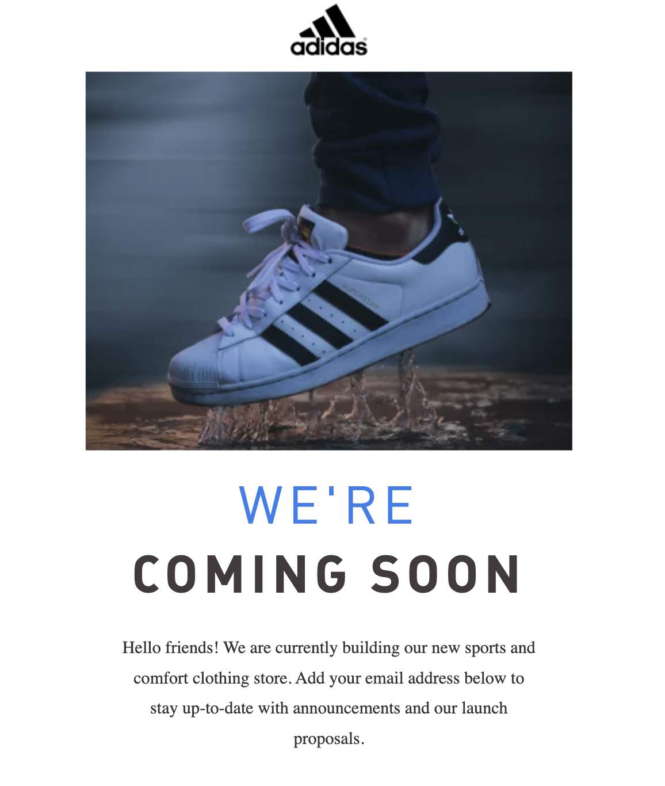

# Adiddas Landing Page 

## Table of contents

- [Overview](#overview)
  - [The challenge](#the-challenge)
  - [Screenshot](#screenshot)
  - [Links](#links)
- [My process](#my-process)
  - [Built with](#built-with)
  - [Useful resources](#useful-resources)
- [Author](#author)

## Overview

### The challenge

Users should be able to:

- View the optimal layout depending on their device's screen size

### Screenshot

### Links

- Solution URL: (https://github.com/ricardoleonh/Coming-Soon-Adidas-2)

## My process

### Built with

- CSS custom properties
- Flexbox
- CSS Grid

### Useful resources

- [Resource 1](https://www.w3schools.com/)
- [Resource 2](https://stackoverflow.com/)

## Author

- Website - [Ricardo Leon](https://github.com/ricardoleonh)
- Twitter - [@ricardoleonh](https://twitter.com/ricardoleonh1)
